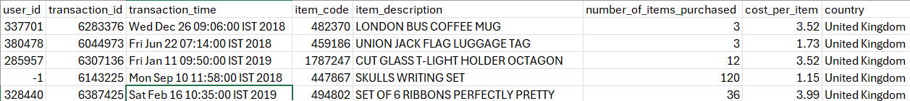
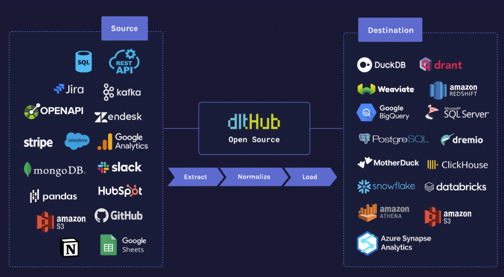

# dlt with Redshift & FastAPI

The project was prepared as a part of the Data Engineering Zoomcamp, a free nine-week course that covers the fundamentals of data engineering. 

The project was prepared as a part of the Data Engineering Zoomcamp, a free nine-week course that covers the fundamentals of data engineering.

* As a part of this project, transactional data was served via a FastAPI REST endpoint;

* dlt, a framework for building HTTP-based service APIs in Python, was used to store the data in AWS S3—a cloud storage service from AWS—as a data lake, and in Redshift, a data warehouse service from AWS;

* Transformations were applied directly in Redshift;

* Clean data was visualized with Redshift QuickSight, a visualization tool from AWS.


The transaction dataset used for the project was downloaded from Kaggle (https://www.kaggle.com/datasets/vipin20/transaction-data) and stored in AWS S3, with FastAPI reading from the bucket. The schema of the dataset is as follows:

* UserId, a unique ID for all User Id
* TransactionId, a unique Transactions ID
* TransactionTime, a transaction Time
* ItemCode, an item code that item will be purchased
* ItemDescription, an item description
* NumberOfItemPurchased, a total number of items Purchased
* CostPerltem, cost per item Purchased
* Country, a country where item purchased 



## Table of Contents

- [Local Environment Setup](#local-environment-setup)
- [FastAPI Setup](#fastapi-setup)
- [AWS S3 and AWS Redshift Setup](#storage-setup)
- [Configuring dlt](#configuring-dlt)
- [Data Transformation in Redshift](#data-transformation)
- [Deployment and Monitoring](#deployment)
- [Visualization](#viz)

### Local Environment Setup

Since the project relies on several Python libraries, I set up a dedicated virtual environment using conda and installed the required Python libraries.

```
conda create -n datapipeline
conda activate datapipeline
pip install fastapi[standard]
pip install dlt
pip install "dlt[redshift]"
pip install "dlt[cli]"
pip install "dlt[s3]"
pip install "dlt[filesystem]
```
### FastAPI Setup

To launch the FastAPI server, you would create a Python file (for example, ```main.py```) that references the dataset stored on your system. In my case, the script to retrieve data from my local environment was as follows:

```
from fastapi import FastAPI, HTTPException, Query
import pandas as pd

app = FastAPI()

# Load CSV and handle NaN values for JSON compatibility
df = pd.read_csv("D:/OneDrive/Documents/zoomcamp/transaction_data.csv")
df = df.where(pd.notnull(df), None)

@app.get("/transaction_details") #type of the http request
def get_data( 
    page: int = Query(1, ge=1, description="Page number (starting at 1)"),
    page_size: int = Query(100, ge=1, le=10, description="Number of items per page") #num of items from 1 to 1000
):
    total = len(df)
    start = (page - 1) * page_size
    end = start + page_size
    if start >= total:
        raise HTTPException(status_code=404, detail="No data found") #loops throughout the pages and throws the error if the data is not found
    page_data = df.iloc[start:end].to_dict(orient="records") #return .json objects
    return {
        "page": page,
        "page_size": page_size,
        "total": total,
        "data": page_data
    }
```
Next, I launch the FastAPI server in development mode by running ```fastapi dev main.py```

To test it, simply visit http://127.0.0.1:8000/{endpoint}. For example, to see the first 100 records, I entered ```http://127.0.0.1:8000/transaction_details?page=1&page_size=100```


Apart from the simplicity of creating the API app, FastAPI also automatically generates interactive API documentation using Swagger UI and Redoc that can be accessed via http://localhost:8000/docs.


### AWS S3 and AWS Redshift Setup

#### Redshift Setup:

You can either use an existing Redshift cluster or create a new one via the AWS console - read more at https://docs.aws.amazon.com/redshift/latest/mgmt/create-cluster.html.

To create a new cluster, navigate to Redshift >> Provisioned Cluster Dashboard' >> Create Cluster where you would be prompted to specify 'Cluster Identifier', 'Node Type', 'Admin User Name', 'Admin Password', 'Database Name', and other params. For simplicity, I configured the data warehouse to be publicly accessible, not recommended in the production mode.

#### S3 Setup
1. You can follow the AWS documentation at https://docs.aws.amazon.com/AmazonS3/latest/userguide/create-bucket-overview.html to create a new bucket (or use an existing one) to be later used as a staging area.
2. Create an IAM user and attach the recommended policies, described by the dlt team at https://dlthub.com/docs/dlt-ecosystem/destinations/filesystem#aws-s3.

### Configuring dlt

Before I dive into the code, let me summarize the dlt framework in short.

dlt (https://dlthub.com/) is an open source data integration library used to extract data from different sources, e.g. REST APIs, databases, etc. and load it into data lakes, data warehouses or send back to applications.


The main building blocks of the dlt framework:

_@dlt.sources_ is used to define connections to data sources and pull data into your pipeline.

_@dlt.resources_ is used to produce tables from the data extracted.

_@dlt.transformer_ is used to define transformations to clean, normalize, or enrich your data.

_pipelines_ are used to "stitch" together different steps, such as data extraction; data normalization or flattening and standardizing data structures; and loading the processed data into the destination.

1. Since I planned to extract data from a REST API and load it to Redshift, I run 
```dlt init rest_api redshift``` to initialize a new project by generating a templated script that serves as the foundation for building a dlt pipeline. Read more at https://dlthub.com/docs/tutorial/rest-api.

2. During the previous stage, I set up AWS credentials to connect to the S3 bucket and added them to a ```.dlt/secrets.toml``` file - the file is excluded from version control:
```
[destination.redshift.credentials]
database = "your_database_name"
password = "your_redshift_password"
username = "your_redshift_username"
host = "your_redshift_cluster_endpoint"
port = 5439
connect_timeout = 15

[destination.filesystem]
bucket_url = "s3://your_bucket_name"

[destination.filesystem.credentials]
aws_access_key_id = "your_aws_access_key"
aws_secret_access_key = "your_aws_secret_key"
```
The templated Python file provided by dlt was adapted as follows:

```
from typing import Any
import os
import dlt
import requests
from dlt.common.pendulum import pendulum
from dlt.sources.rest_api import RESTAPIConfig, rest_api_resources


@dlt.source(name="custom")
def custom_source() -> Any:
    """Configurations for the pipeline"""
    config: RESTAPIConfig = {
        "client": {
            "base_url": "http://localhost:8000",  #render's API
        },
        "resource_defaults": {
            "endpoint": {
                "params": {
                    "page": 1,
                    "page_size": 1000,
                },
            },
        },
        "resources": [
            {
                "name": "transaction_details",  
                "endpoint": "transaction_details",  
            },
        ],
    }
    yield from rest_api_resources(config)


def run_redshift_pipeline() -> None:
    """Creading the pipeline"""
    pipeline = dlt.pipeline(
        pipeline_name="redshift_pipeline",
        destination="redshift",
        staging="filesystem",  #dumping the data prior to storing in redshift
        dataset_name="transaction_details_data"
    )
    load_info = pipeline.run(custom_source())
    print("Redshift pipeline load info:", load_info)


def run_s3_pipeline() -> None:
    """Storing data in s3"""
    pipeline = dlt.pipeline(
        pipeline_name="s3_pipeline",
        destination="filesystem",
        dataset_name="s3_transaction_details"
    )
    load_info = pipeline.run(custom_source())
    print("Filesystem pipeline load info:", load_info)


if __name__ == "__main__":
    run_redshift_pipeline()
    run_s3_pipeline()
    ```

### Data Transformation in Redshift

Once I confirmed that the data was loaded, I created an SQL view to transform and clean the dataset. The original transaction_time column was in the format 'Wed Dec 26 09:06:00 IST 2018'. In addition, the columns for number_of_items_purchased and cost_per_item were stored as varchar, making arithmetic operations in Redshift inconvenient.
```
CREATE VIEW transaction_details_cleaned AS
SELECT 
    user_id,
    transaction_id,
    item_code,
    item_description,
    CAST(number_of_items_purchased AS NUMERIC) AS number_of_items_purchased,
    CAST(cost_per_item AS NUMERIC) AS cost_per_item,
    country,
  to_char(
    to_timestamp(
      trim(replace(substring(transaction_time, 5), 'IST', '')),
      'Mon DD HH24:MI:SS YYYY'
    ),
    'YYYY-MM-DD HH24:MI:SS'
  ) AS transaction_timestamp,
    _dlt_load_id,
    _dlt_id
FROM "zoomcamp"."transaction_details_data"."transaction_details";
```
### Deployment and Monitoring

1. To deploy my FastAPI app, I chose Render, a cloud hosting service, by uploading my main.py to another Github repositry - https://github.com/eponkratova/zoomcamp_course_project_render and creating a web service. 

Render is a modern cloud platform that simplifies the process of deploying and scaling web applications, offering continuous deployment.

The setup process is extremelly quick, providing that you added your env variables to the Render's env - which I didn't do initially, correctly specifying buckets and folders - which I didn't do, adjusting the script to load the file uploaded to S3 - which I didn't do either. Read more at https://render.com/docs/deploy-fastapi


2. The dlt team already did the heavy lifting by detailing the deployment of dlt pipelines with GitHub Actions at https://dlthub.com/docs/walkthroughs/deploy-a-pipeline/deploy-with-github-actions. It's as simple as running ```dlt deploy {yourpipline}.py github-action --schedule "*/30 * * * *"```. 

To view your  generated.yml file, open your repository >> Actions. I did notice, however, that the environment variables were not created automatically, so I added them manually by going to GitHub repo >> Settings >> Secrets:

* REDSHIFT_DB
* REDSHIFT_USER
* REDSHIFT_HOST
* REDSHIFT_PORT
* REDSHIFT_PASSWORD
* AWS_BUCKET_URL
* AWS_SECRET_ACCESS_KEY
* AWS_ACCESS_KEY_ID

```
name: Run redshift_pipeline pipeline from rest_api_pipeline.py
'on':
  schedule:
  - cron: '*/30 * * * *'
  workflow_dispatch: null
env:
  DESTINATION__REDSHIFT__CREDENTIALS__DATABASE: ${{ secrets.REDSHIFT_DB }}
  DESTINATION__REDSHIFT__CREDENTIALS__USERNAME: ${{ secrets.REDSHIFT_USER }}
  DESTINATION__REDSHIFT__CREDENTIALS__HOST: ${{ secrets.REDSHIFT_HOST }}
  DESTINATION__REDSHIFT__CREDENTIALS__PORT:  ${{ secrets.REDSHIFT_PORT }}
  DESTINATION__REDSHIFT__CREDENTIALS__CONNECT_TIMEOUT: '15'
  DESTINATION__REDSHIFT__CREDENTIALS__PASSWORD: ${{ secrets.REDSHIFT_PASSWORD }}
  REDSHIFT_PIPELINE__DESTINATION__FILESYSTEM__BUCKET_URL: ${{ secrets.AWS_BUCKET_URL }}
  REDSHIFT_PIPELINE__BUCKET_URL: ${{ secrets.AWS_BUCKET_URL }}
  REDSHIFT_PIPELINE__DESTINATION__BUCKET_URL: ${{ secrets.AWS_BUCKET_URL }}
  DESTINATION__FILESYSTEM__BUCKET_URL: ${{ secrets.AWS_BUCKET_URL }}
  DESTINATION__BUCKET_URL: ${{ secrets.AWS_BUCKET_URL }}
  BUCKET_URL: ${{ secrets.AWS_BUCKET_URL }}
REDSHIFT_PIPELINE__DESTINATION__CREDENTIALS__AWS_SECRET_ACCESS_KEY: ${{ secrets.AWS_SECRET_ACCESS_KEY }}
  REDSHIFT_PIPELINE__CREDENTIALS__AWS_SECRET_ACCESS_KEY: ${{ secrets.AWS_SECRET_ACCESS_KEY }}
  DESTINATION__FILESYSTEM__CREDENTIALS__AWS_SECRET_ACCESS_KEY: ${{ secrets.AWS_SECRET_ACCESS_KEY }}
  DESTINATION__CREDENTIALS__AWS_SECRET_ACCESS_KEY: ${{ secrets.AWS_SECRET_ACCESS_KEY }}
  CREDENTIALS__AWS_SECRET_ACCESS_KEY: ${{ secrets.AWS_SECRET_ACCESS_KEY }}
REDSHIFT_PIPELINE__DESTINATION__FILESYSTEM__CREDENTIALS__AWS_ACCESS_KEY_ID: ${{ secrets.AWS_ACCESS_KEY_ID }}
  REDSHIFT_PIPELINE__DESTINATION__CREDENTIALS__AWS_ACCESS_KEY_ID: ${{ secrets.AWS_ACCESS_KEY_ID }}
  REDSHIFT_PIPELINE__CREDENTIALS__AWS_ACCESS_KEY_ID: ${{ secrets.AWS_ACCESS_KEY_ID }}
  DESTINATION__FILESYSTEM__CREDENTIALS__AWS_ACCESS_KEY_ID: ${{ secrets.AWS_ACCESS_KEY_ID }}
  DESTINATION__CREDENTIALS__AWS_ACCESS_KEY_ID: ${{ secrets.AWS_ACCESS_KEY_ID }}
  CREDENTIALS__AWS_ACCESS_KEY_ID: ${{ secrets.AWS_ACCESS_KEY_ID }}
  AWS_ACCESS_KEY_ID: ${{ secrets.AWS_ACCESS_KEY_ID }}
  AWS_SECRET_ACCESS_KEY: ${{ secrets.AWS_SECRET_ACCESS_KEY }}

jobs:
  maybe_skip:
    runs-on: ubuntu-latest
    outputs:
      should_skip: ${{ steps.skip_check.outputs.should_skip }}
    steps:
    - id: skip_check
      uses: fkirc/skip-duplicate-actions@v5
      with:
        concurrent_skipping: always
        skip_after_successful_duplicate: 'false'
        do_not_skip: '[]'
  run_pipeline:
    needs: maybe_skip
    if: needs.maybe_skip.outputs.should_skip != 'true'
    runs-on: ubuntu-latest
    steps:
    - name: Check out
      uses: actions/checkout@v3
    - name: Setup Python
      uses: actions/setup-python@v4
      with:
        python-version: 3.10.x
    - uses: syphar/restore-virtualenv@v1
      id: cache-virtualenv
      with:
        requirement_files: requirements_github_action.txt
    - uses: syphar/restore-pip-download-cache@v1
      if: steps.cache-virtualenv.outputs.cache-hit != 'true'
    - run: pip install -r requirements_github_action.txt
      if: steps.cache-virtualenv.outputs.cache-hit != 'true'
    - name: Run pipeline script
      run: python 'rest_api_pipeline.py'

      ```
And whola, your workflow can be triggered manually or run automatically on a defined schedule.

### Visualization

Now as I have the clean dataset, I was able to connect Amazon QuickSight to visualize it by specifying the Redshift cluster details. 


